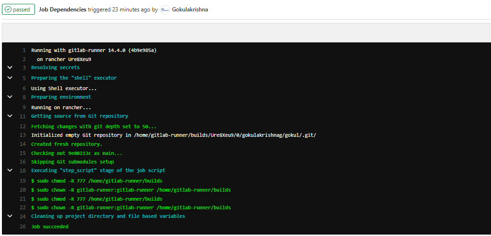
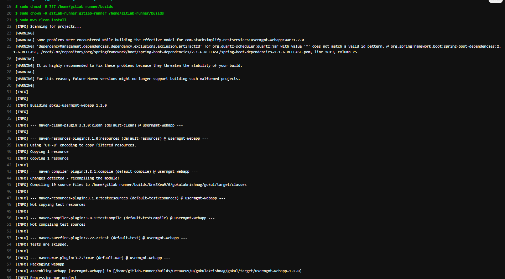
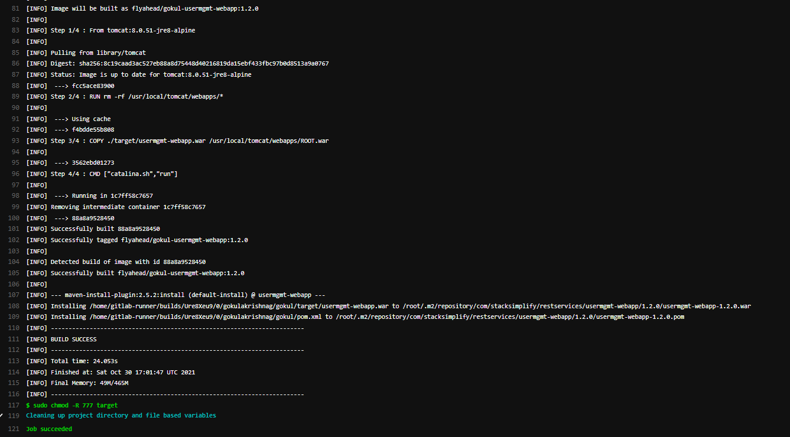
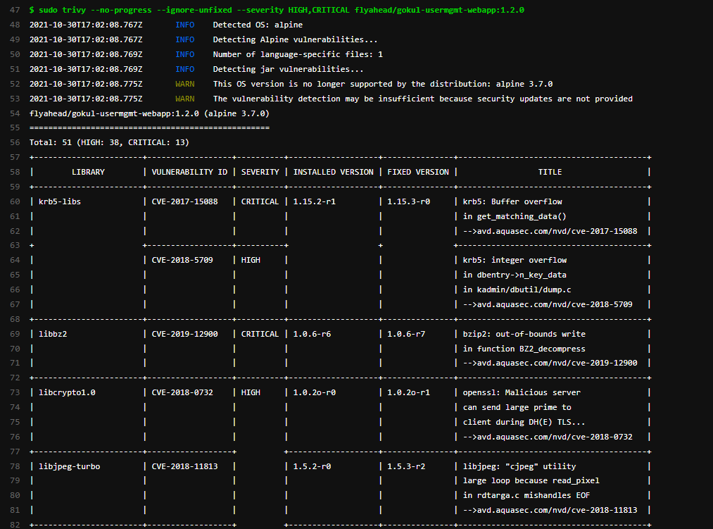
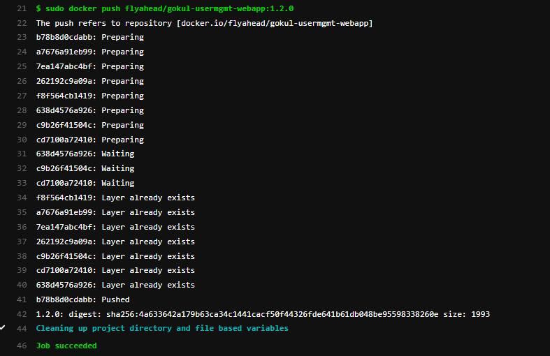
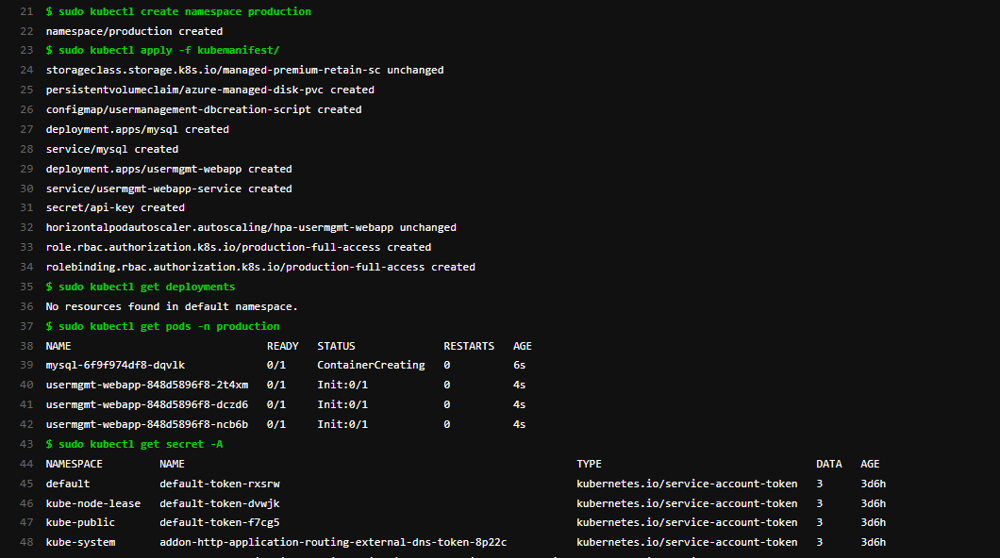
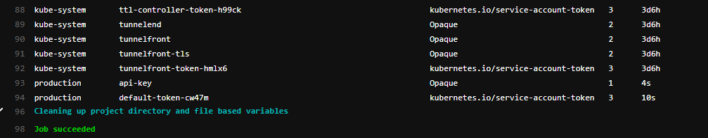
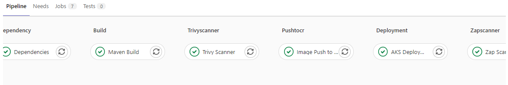

# Understood the given requirement and completed the tasks
```
- Please read entire read.me file
```
## Repo created in github / gitlab and solved below Option 1 problem
```
1. Create a kubernetes deployment, svc, hpa, pdb service account in kubernetes cluster. can be PaaS/Minikube
 - Created a kubernetes Java Application with Mysql DB deployment, svc, hpa, pdb service account in AKS kubernetes cluster
2. Deployment needs a secret with name API_KEY
 - Both Mysql and Usermanagement WebApp deployments need a secret with name API-KEY
3. Mount this secret in deployment
 - Mounted this secret.
4. API_KEY should be a environment variables within the container when container starts inside a pod
 - API_KEY is refered as mysqldbpassword in Mysql environment variables within the container when container starts inside a pod
5. API_KEY env variable is not used yet in app, but we want to see the approach
 - API_KEY env variable is not used yet in app, once the Mysql / Usermanagement WebApp pod created it get the mysql db password from secret
```
## Acceptance criteria
```
1. You must provide your code in full with kubernetes manifests or pipelines or scripts
  - Provided entire code in full with kubernetes manifests, pipelines, scripts.
2. You must use either public cloud(AWS, GCP, Azure) or Minikube to run the above manifests file
  - Deployed in Azure Public cloud.
3. You do not need to provide access to the cluster in public cloud, only the code  
  - Also provided rancher access for 1 one day to check deployment and also multi-cloud k8's cluster management.
4. Your code is clean and readable
  - I hope entire code is clean and readable
5. You must document any steps that are not automated in the README.md
  - Documented all steps that are automated and not automated in the README.md
6. You must have dedicated service account for deployment
  - Created dedicated service account(gitlab-runner)for deployment (you can check in https://gitlab.com/gokulakrishnag/gokul/-/blob/main/pre-requisites-serviceaccount-role-rolebinding.yml)
7. You must have NodePort Type of service for application
  - Created NodePort Type of service for application (I have included NodePort in the code but I have used to LoadBalancer in my Demo)
8. You must have Minimum 2 pods always up and running
  - Allocated minimum 2 pods always up and running
9. You must have only 1 pod unavailable during Rolling Update of Deployment
  - Allocated only 1 pod unavailable during Rolling Update of Deployment
```
## Assumptions
```
1. Can use any open-source tools/language to solve problem
  - Used Gitlab for store code and pipeline
  - Used Trivy for container scanning
  - Custom gitlab-runner and below tools installed in centos which running on GCP
    - Git
    - Java, Maven installed
    - Azure CLI installed for login to azure 
    - Trivy installed
    - Docker installed
    - Kubectl service installed 
2. Create extra code if needed like infra(terraform, scripts) etc in same repo
  - Created AKS cluster using terraform script add in same repo
3. Choose simple applications from internet e.g. nginx, httpd
  - Used Java User Management Apllication with Mysql DB
```

## Bonus
```
1. Deployment container is scanned before getting deployed. If severity is high, pipeline should fail
  - Yes the Trivy scanner included and added condition to fail the pipeline
  - Also added DAST Testing using OWASP ZAP Scaner
2. Container in Pod, should not be running as root
  - Yes not a root user
3. Provide any code that you required to accomplish this task
  - Provided Terraform Azure AKS Cluster provisioning code
  - Provided Java and Mysql Based Microservices App Code
  - Provided Gitlab Pipeline Code
  - Provided App Deployment Kubenetes manifests
4. You must document any steps that are not automated in the README.md
  - Documented all steps
```
# Pre-requisites
```
- Created Gitlab runner VM in GCP
- Installed following tools in Gitlab Runner
  - Trivy
  - Kubectl
  - Azure Cli
  - Docker
  - Java
  - Maven
  - Terraform
- Created AKS cluster using terraform script from gitlab runner VM add in same repo (check it from following url https://gitlab.com/gokulakrishnag/gokul/-/tree/terraform )
- Created service account gitlab-runner to login to cluster with its secret and token  (to check gitlabrunner service account YAML from following url https://gitlab.com/gokulakrishnag/gokul/-/blob/main/pre-requisites-serviceaccount-role-rolebinding.yml)
- GitLab Account
- Created Required Kubemanifest files and add in repo
- Created Pipeline using .gitlab-ci.yml
  -stages:
    - dependency
    - build
    - trivyscanner
    - pushtocr
    - deployment
    - zapscanner
```
## GitLab Pipeline Code '.gitlab-ci.yml'
```
stages:
  - dependency
  - build
  - trivyscanner
  - pushtocr
  - deployment
  - zapscanner
variables:
  GIT_STRATEGY: clone

before_script: # to cross check the permission applied, so added same script (before script) in this stage
  - sudo chmod -R 777 /home/gitlab-runner/builds
  - sudo chown -R gitlab-runner:gitlab-runner /home/gitlab-runner/builds

Dependencies: # to cross check added same before script in this stage
  stage: dependency
  script:
    - sudo chmod -R 777 /home/gitlab-runner/builds
    - sudo chown -R gitlab-runner:gitlab-runner /home/gitlab-runner/builds
  tags:
    - devops
  only:
    - main

Maven Build:
  stage: build
  script:
    - sudo mvn clean install
    - sudo chmod -R 777 target
  tags:
    - devops
  only:
    - main

Trivy Scanner:
  stage: trivyscanner
  script:
    - sudo docker images
    - sudo trivy --exit-code 1 --no-progress --ignore-unfixed --severity HIGH,CRITICAL flyahead/gokul-usermgmt-webapp:1.2.0 # if the image has high or critical vulnerability pipeline will be exited.
   # - sudo trivy --no-progress --ignore-unfixed --severity HIGH,CRITICAL flyahead/gokul-usermgmt-webapp:1.2.0 # if you removed the --exit-code it go to next stage.
  tags:
    - devops
  only:
    - main

Image Push to Docker Hub:
  stage: pushtocr
  script:
    - sudo docker push flyahead/gokul-usermgmt-webapp:1.2.0
  tags:
    - devops
  only:
    - main  

AKS Deployment:
  stage: deployment
  script:
    - sudo kubectl create namespace production
    - sudo kubectl apply -f kubemanifest/
    - sudo kubectl get deployments -n production
    - sudo kubectl get pods -n production
    - sudo kubectl get secret -n production
  tags:
    - devops
  only:
    - main

Zap Scanner:
  stage: zapscanner
  script:
    - sudo kubectl get service -n production
    - |
      ServiceIP=`sudo kubectl get svc -n production | grep usermgmt-webapp-service | awk '{print $4}'`
    - sudo docker run -v $(pwd)/report:/zap/wrk/:rw -t owasp/zap2docker-stable zap-baseline.py -I -t http://$ServiceIP -r testreport.html
  tags:
    - devops
  only:
    - main

```
## Kubemanifest Detail
### Storage Class YAML
```
apiVersion: storage.k8s.io/v1
kind: StorageClass
metadata:
  name: managed-premium-retain-sc
provisioner: kubernetes.io/azure-disk
reclaimPolicy: Retain  # Default is Delete, recommended is retain
volumeBindingMode: WaitForFirstConsumer # Default is Immediate, recommended is WaitForFirstConsumer
allowVolumeExpansion: true  
parameters:
  storageaccounttype: Premium_LRS # or we can use Standard_LRS
  kind: Managed # Default is shared, recommended is Managed

```
### Persistent Volume Claim YAML
```
apiVersion: v1
kind: PersistentVolumeClaim
metadata:
  namespace: production
  name: azure-managed-disk-pvc
spec:
  accessModes:
  - ReadWriteOnce
  storageClassName: managed-premium-retain-sc 
  resources:
    requests:
      storage: 5Gi      
# Mapped PVC with customized storage class to retain
# AKS already provisioned Storage classes managed-premium 
```
### MySQL Deployment YAML
```
apiVersion: apps/v1
kind: Deployment
metadata:
  namespace: production
  name: mysql
spec:
  replicas: 1
  strategy:
    type: Recreate
  selector:
    matchLabels:
      app: mysql
  template: 
    metadata: 
      labels: 
        app: mysql
    spec: 
      containers:
        - name: mysql
          image: mysql:5.6
          env:
            - name: MYSQL_ROOT_PASSWORD
              valueFrom: 
                secretKeyRef:
                  name: api-key # mysql-db-password
                  key: db-password
          ports:
            - containerPort: 3306
              name: mysql    
          volumeMounts:
            - name: mysql-persistent-storage
              mountPath: /var/lib/mysql    
            - name: usermanagement-dbcreation-script
              mountPath: /docker-entrypoint-initdb.d # Refer Initializing a fresh instance                                            
      volumes: 
        - name: mysql-persistent-storage
          persistentVolumeClaim:
            claimName: azure-managed-disk-pvc
        - name: usermanagement-dbcreation-script
          configMap:
            name: usermanagement-dbcreation-script
``` 
### Created Secret for MySQL environment DB Password  YAML (kubernetes Secrets YAML)
```
'dbpassword11' changed to base64 format
 URL: https://www.base64encode.org
---
apiVersion: v1
kind: Secret
metadata:
  namespace: production
  name: api-key # mysql-db-password
type: Opaque # password format changed base64 that's why here we used opaque
data:
  db-password: ZGJwYXNzd29yZDEx
---
```
## MySQL usermgmnt-dbcreation-script
```
apiVersion: v1
kind: ConfigMap
metadata:
  namespace: production
  name: usermanagement-dbcreation-script
data: 
  mysql_usermgmt.sql: |-
    DROP DATABASE IF EXISTS webappdb;
    CREATE DATABASE webappdb; 
```
## User Management WebApp Deployment YAML
```
apiVersion: apps/v1
kind: Deployment 
metadata:
  namespace: production
  name: usermgmt-webapp
  labels:
    app: usermgmt-webapp
spec:
  replicas: 3
  strategy:
    type: RollingUpdate
    rollingUpdate:
      maxSurge: 2        # how many pods we can add at a time
      maxUnavailable: 1  # maxUnavailable define how many pods can be unavailable # during the rolling update           
  selector:
    matchLabels:
      app: usermgmt-webapp
  template:  
    metadata:
      labels: 
        app: usermgmt-webapp
    spec:
      initContainers:
        - name: init-db
          image: busybox:1.31
          command: ['sh', '-c', 'echo -e "Checking for the availability of MySQL Server deployment"; while ! nc -z mysql 3306; do sleep 1; printf "-"; done; echo -e "  >> MySQL DB Server has started";']      
      containers:
        - name: usermgmt-webapp
          image: flyahead/gokul-usermgmt-webapp:1.2.0
          imagePullPolicy: Always
          ports: 
            - containerPort: 8080           
          env:
            - name: DB_HOSTNAME
              value: "mysql"            
            - name: DB_PORT
              value: "3306"            
            - name: DB_NAME
              value: "webappdb"            
            - name: DB_USERNAME
              value: "root"            
            - name: DB_PASSWORD
              valueFrom: 
                secretKeyRef:
                  name: api-key
                  key: db-password
```
## User Management WebApp Service YAML
```
apiVersion: v1
kind: Service
metadata:
  namespace: production
  name: usermgmt-webapp-service
  labels: 
    app: usermgmt-webapp
spec: 
  type: NodePort #can use NodePort / LoadBalancer / Ingress for external access, here i used LoadBalancer because it recommended method.
  selector: 
    app: usermgmt-webapp
  ports: 
    - port: 80
      targetPort: 8080
```
## HPA User Management WebApp YAML
```
apiVersion: autoscaling/v1
kind: HorizontalPodAutoscaler
metadata:
  name: hpa-usermgmt-webapp
spec:
  scaleTargetRef:
    apiVersion: apps/v1
    kind: Deployment
    name: usermgmt-webapp
  minReplicas: 1
  maxReplicas: 10
  targetCPUUtilizationPercentage: 50
# HPA Imperative - Replace
# kubectl autoscale deployment hpa-demo-deployment --cpu-percent=50 --min=1 --max=10
```
# Implementation Part

## GitLab Pipeline
### Once the Pipeline is triggered:
```
Stage 1 (Dependency): 
 - It will start to run the dependencies stage.
 - This stage will help to execute all other stages in GitLab-runner without any issues.
```

```
Stage 2 (Build): 
 - It will start to run the Java Maven build.
  - Once the war file build is completed.
  - it will start to execute the docker file.
    - it will pull the tomcat image and copy the code into the container.
    - Once code is copied, it will start to build the image.
 ```
 
 
 ```
Stage 3 (Trivy Scanner): Trivy is a container image vulnerability scanner
 - Trivy will start to scan the built image in Stage 2
 - once the scan gets completed it will show the report in the pipeline console screen.
 - if the severity is High and critical it will exit the process and it will not go next stage (I have commented on this step in pipeline code because in my application it shows known/accepted vulnerabilities).
```

```
Stage 4 (Push to Container Registry)
 - It will start to push the image into the Docker hub registry
```

```
Stage 5 (Deployment)
 - It will start to deploy created Kube manifests
	- it will create the namespace production
    - it will create Custom Storage Class and apply to reclaim policy as retain to prevent deletion of PV.
    - Persistent Volume claim and using created storage class.
    - it will Create MySQL Pod with 1 replica and Strategy type Recreate
    - To store and recall non-confidential data from config map file to deployment or other k8s YAML files
       - Create a mysql_usrmgmt.sql file used to drop if already webappdb avail or it will create the DB.
    - To create a Secret file(API-KEY) to keep safe one of the MySQL DB environment configuration mysqldb password.
       - API-KEY environment variable is not used yet in the MySQL pod container, once the container gets created it will fetch the password from the secret file.
    - Created MySQL Cluster IP Service on port 3306
	- Created User Management Application Pod Deployment with 3 replicas and strategy type is RollingUpdate
	   - Add MaxSurge = 2 ( can add 2 pods at a update time) and MaxUnavailable = 1 (only 1 pod unavailable during Rolling Update of Deployment)
	   - Added init container to wait until MySQL service is available.
	   - API-KEY environment variable is not used yet in the user management pod container, once the container gets created it will fetch the password from the secret file.
	- Created user-mgmt-web app LoadBalancer (in code i have mentioned NodeBalancer, here i used LoadBalancer because it recommended method) Service on port 80 and target port is 8080.
	- Created HPA for user-mgmt-webapp with minReplicas = 2 maxReplicas = 10 targetCPUUtilizationPercentage: 50
```


```
Stage 6 (Zap Scanner)

 - It will start DAST scanning with the application URL and provide the report.
```

## Pipeline Success



# Access Application
```
http://<External-IP-from-get-service-output>
Username: admin101
Password: password101
```
